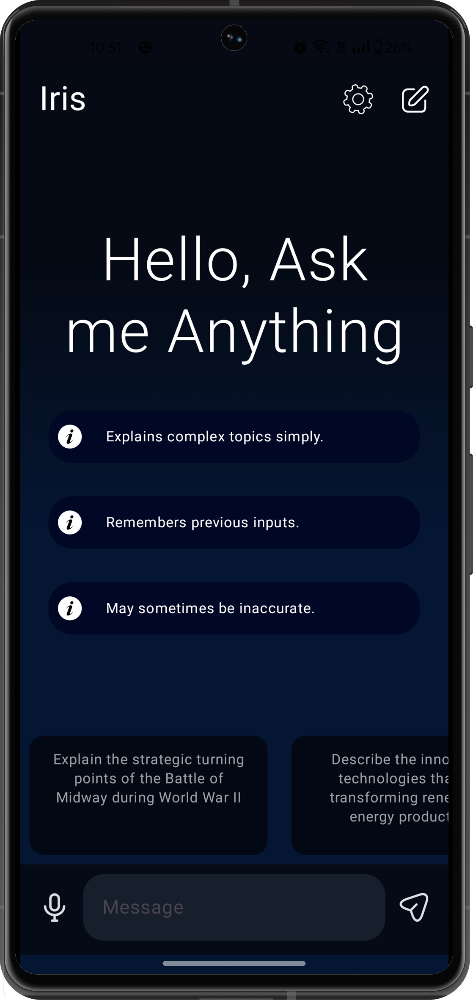
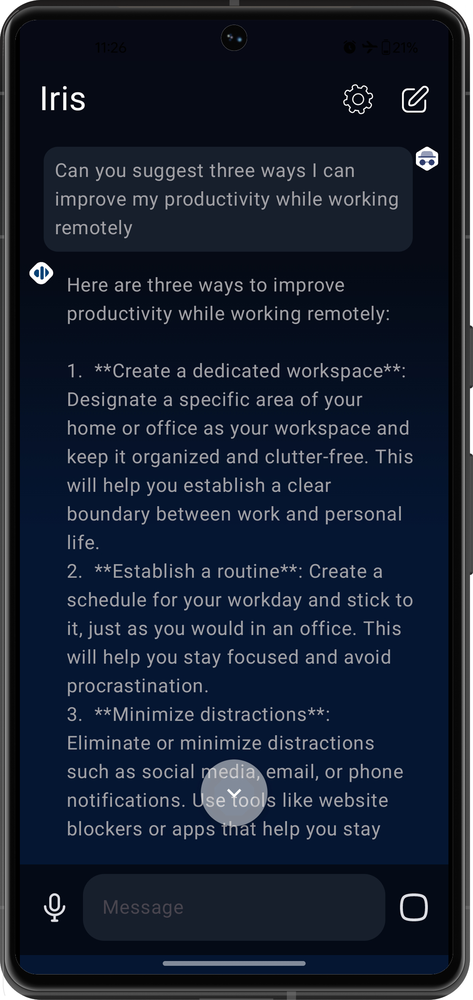
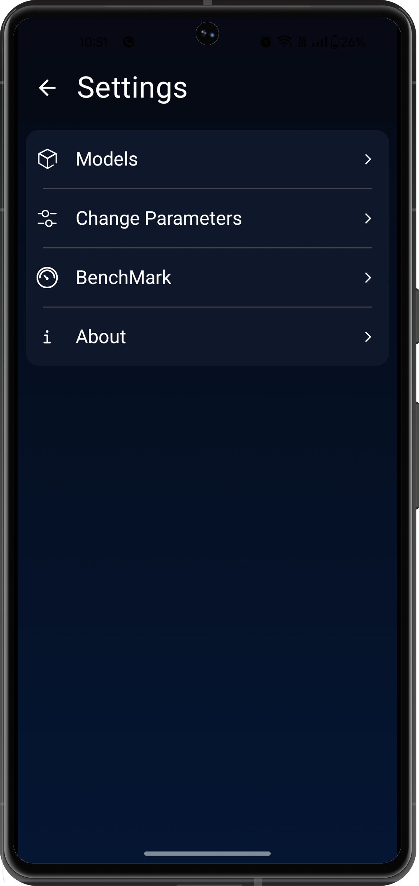
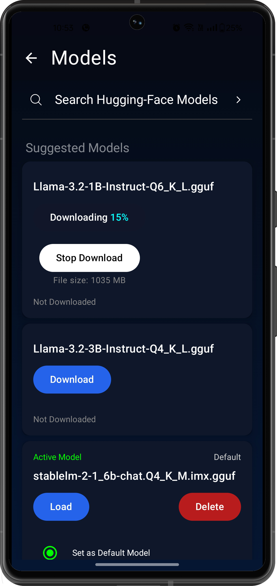
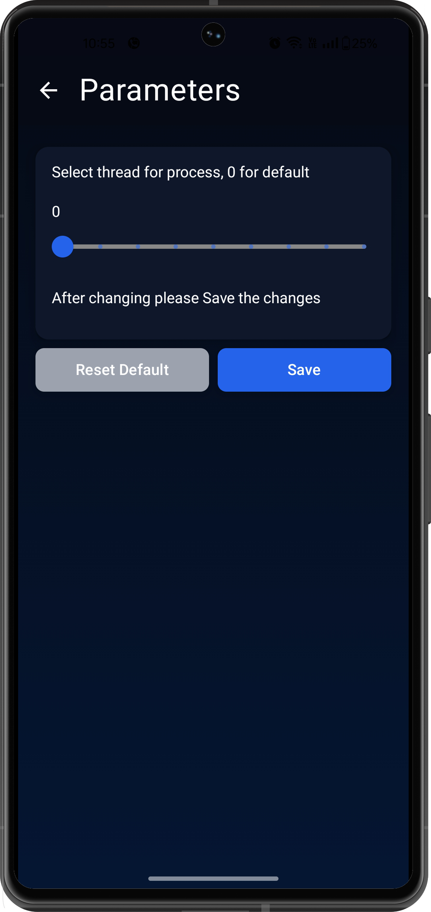

# Iris


Project Description
-------------

- This repository contains llama.cpp based offline android chat application cloned from llama.cpp android example. Install, download model and run completely offline privately.
- The app supports downloading GGUF models from Hugging Face and offers customizable parameters for flexible use.
- Being open-source, it allows for easy modifications and improvements, providing a secure, private, and fully offline experience.

Images
-------------
<div style ="display: flex; gap: 15px;"> 





</div>


Run
-------------
- Go to releases : https://github.com/nerve-sparks/iris_android/releases
- Download app
- Install app

Features
------------

- Works Offline: Access all features without needing an internet connection.
- Privacy-Focused: All data is processed securely on your device.
- Expandable Models: Download external GGUF models from Hugging Face for added functionality.
- Open Source: Fully transparent development.
- Customizable Parameters: Adjust settings to match your specific requirements.

Build
-------------
- Download Android studio
- Clone this repository and import into Android Studio

```bash
 git clone https://github.com/nerve-sparks/iris_android.git
 ```
- Clone the llama.cpp repository in the same folder as iris_android

```bash
 git clone https://github.com/ggerganov/llama.cpp
 ```

- Open developer options on the Android mobile phone.
- Enable developer options.
- Click on developer options and enable wireless debugging.
- In Android Studio, select the drop down on the left side of the 'app' button on the Navbar.
- Select on 'Pair devices using Wi-Fi'. A QR code appears on screen.
- Click on wireless debugging on Android phone. Select 'Pair device with QR code'. Scan the code. (Make sure both devices are on the same Wi-fi)
- You can use Usb Debugging also to connect your phone.
- Once the phone is connected, select the device name in the drop down menu and click on play button.
- In the app, click on 'Download Stable LM'. The model will download and load automatically.
- Now you can run the app offline. (In airplane mode as well)


Maintained by Nerve Sparks 
-------------
- Visit www.nervesparks.com to contact us.

Your "Contributing" section looks good, but here's a slightly refined version for clarity and consistency:

---

### Contributing  
1. **Fork the repository.**  
2. **Create a new feature branch:**  
   ```bash
   git checkout -b my-new-feature
   ```
3. **Commit your changes:**  
   ```bash
   git commit -m 'Add some feature'
   ```
4. **Push your branch to the remote repository:**  
   ```bash
   git push origin my-new-feature
   ```
5. **Open a Pull Request.**

---

This version keeps the steps concise while ensuring that each command is clear.